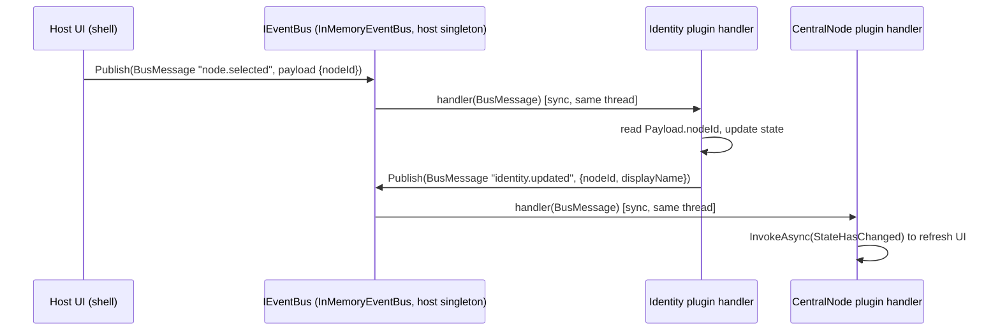
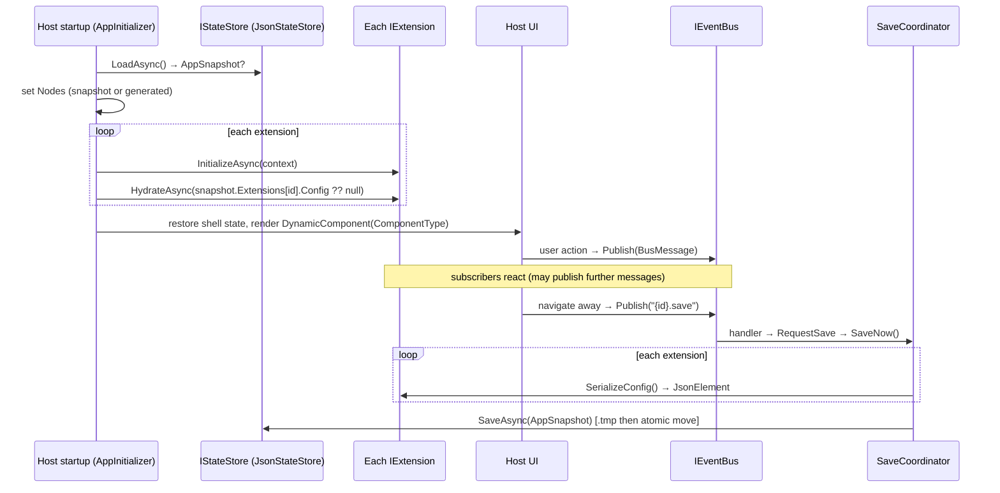

# NodeConfigurator — Architecture Report

A deep technical description of the runtime plugin architecture used by the NodeConfigurator
.NET MAUI Blazor Hybrid host.

---

**Goals**

- Let independent teams build, version, and ship UI extensions **without recompiling the host**.
- Load plugins at runtime from disk based on configuration.
- Achieve **dependency isolation** so plugins can use conflicting versions of the same library.
- Keep the shared surface (the "boundary" / thin waist) as **small and stable** as possible.
- Render each plugin's Razor UI inside the host as a first-class component.
- Fail safe: a broken plugin is skipped, not fatal.

**Non-goals**

- Security sandboxing of untrusted code (plugins run in-process, full trust).
- Contract-version negotiation / gating at runtime (the contract is fixed).
- Isolating the base runtime or the Blazor component model (impossible in-process without breaking
  type identity).
- Hot-reload of plugins while the host is running (current model loads at startup — see
  *Plugin update strategy*).

---

**Architecture Principles**

- **Independent teams** — each plugin is a separate repo with its own pipeline. The only shared
  code is the `NodeConfigurator.Abstractions` NuGet package.
- **Physical separation** — plugins deploy to `C:\plugins\<pluginId>\<version>\`, entirely outside
  the host's install folder.
- **Decoupling** — plugins depend on interfaces (`IExtension`, `IExtensionContext`) not host types.
  The host never references plugin assemblies at compile time.
- **Thin waist** — a minimal set of assemblies is shared across the boundary; everything else is
  isolated per plugin. The narrower the waist, the more freedom plugins have.

---

**Detailed Plugin Lifecycle**

Orchestrated by `PluginLoader.LoadAll()`:

```
discovery → version selection → manifest parsing → ALC creation →
dependency resolution → assembly load → type discovery →
IExtension instantiation → registration into host → rendering
```

1. **Discovery** — `CollectCandidateFolders` gathers candidate folders:
   - Explicit folders from `Plugins:Paths` (missing/empty folders recorded as failures).
   - Discovered folders by scanning each `Plugins:PluginRoots` entry. `DiscoverPluginFolders`
	 supports two layouts:
	 - Flat: `<root>\<name>\manifest.json`
	 - Versioned: `<root>\<name>\<version>\manifest.json`
   - A folder qualifies only if it directly contains `manifest.json`. Candidates are de-duplicated
	 by normalized path (explicit wins over discovered).

2. **Manifest parsing** — `ReadCandidateManifests` calls `PluginManifestReader.Read` for each
   candidate. Missing/invalid manifests become `FailedPlugin` entries (honoring `ContinueOnError`).

3. **Version selection** — `SelectHighestVersionPerId` groups parsed candidates by `manifest.id`
   and keeps the **highest** semantic version. An unparseable version sorts lowest; on an
   exact-version tie an explicit `Paths` entry wins over a discovered one. Every dropped duplicate
   is logged.

4. **ALC creation** — for each winner, a `PluginLoadContext` is constructed
   (`new PluginLoadContext(entryAssemblyPath, pluginId)`), a **collectible** `AssemblyLoadContext`
   named `Plugin:<id>`.

5. **Dependency resolution** — the `PluginLoadContext` uses an `AssemblyDependencyResolver` built
   from the plugin's entry assembly path; it reads the plugin's `.deps.json` to resolve private
   dependencies from the plugin folder. Boundary assemblies are deferred to the host (see below).

6. **Assembly load** — the entry assembly (`manifest.entryAssembly`) is loaded into the ALC.
   Any `preloadAssemblies` declared in the manifest can be loaded first.

7. **Type discovery** — the loader locates `manifest.entryType` (the fully-qualified `IExtension`
   implementation type name) in the loaded assembly.

8. **IExtension instantiation** — the entry type is created via reflection and cast to
   `IExtension`. Because Abstractions is a boundary assembly, the cast succeeds (single type
   identity).

9. **Registration into host** — the resulting `LoadedPlugin` (manifest + load context + assembly +
   `IExtension`) is added to `PluginLoadResult.Loaded`, and the `IExtension` is placed in the
   extension registry (`PluginExtensionRegistry`). The host then calls
   `IExtension.InitializeAsync(IExtensionContext)` and `HydrateAsync(savedConfig)` as part of
   app initialization.

10. **Rendering** — the host renders `IExtension.ComponentType` (a `ComponentBase`-derived Razor
	component) using Blazor's `DynamicComponent`. Extensions implementing `INodeEditorContributor`
	additionally expose a node-scoped editor component (`NodeEditorComponentType`).

Failures at any load step become `FailedPlugin` entries; with `ContinueOnError = true` the host
skips them and continues.

---

**AssemblyLoadContext Design**

*Why per-plugin ALC?*

Each plugin is loaded into its own collectible `PluginLoadContext`. This gives:

- **Version independence** — a plugin's private dependencies resolve from its own folder, so two
  plugins can ship different versions of the same library.
- **Type-identity control** — boundary types resolve to the host's single copy, so casts and
  rendering work across the boundary.
- **Unloadability** — collectible contexts can (in principle) be unloaded for future reload
  scenarios.

*How dependency resolution works (`PluginLoadContext.Load`)*

The overriding `Load(AssemblyName)` follows an "isolate what the plugin ships" order:

```csharp
protected override Assembly? Load(AssemblyName assemblyName)
{
	// (a) Boundary assembly → defer to host's default context (single Type identity).
	if (IsBoundaryAssembly(assemblyName))
		return null;

	// (b) Plugin shipped it (found via .deps.json) → load an ISOLATED copy from the plugin folder.
	var assemblyPath = _resolver.ResolveAssemblyToPath(assemblyName);
	if (assemblyPath is not null)
		return LoadFromAssemblyPath(assemblyPath);

	// (c) Not boundary, not shipped → framework/runtime assembly from host default context.
	return null;
}
```

Native libraries are resolved analogously via `LoadUnmanagedDll` using
`_resolver.ResolveUnmanagedDllToPath`.

*What is the "boundary" and how it is enforced*

The **boundary** is the set of assemblies whose *types appear on the public surface exchanged
between host and plugins*. If a plugin loaded its own copy of these, its `IExtension`,
`JsonElement`, or `ComponentBase` would be a *different* `Type` than the host's, causing
`InvalidCastException`s. Enforcement is conceptual and centralized in `PluginLoadContext`:

Exact-match boundary assemblies (`BoundaryAssemblyNames`):

```
NodeConfigurator.Abstractions                              // the contract itself (IExtension, IExtensionContext, Node, BusMessage)
System.Text.Json                                           // JsonElement is on the contract surface (SerializeConfig/HydrateAsync/BusMessage.Payload)
Microsoft.JSInterop                                        // IJSRuntime flows through the shared Blazor pipeline
Microsoft.Extensions.DependencyInjection.Abstractions      // plugin components injected by host DI ([Inject], IServiceProvider)
Microsoft.Extensions.Logging.Abstractions                  // ILogger/ILogger<T> injected into plugin components
```

Prefix-match boundary assemblies (`BoundaryAssemblyPrefixes`):

```
Microsoft.AspNetCore.Components*                           // Blazor component model — plugin Razor components render in the host renderer
```

Two categories are unified by the **runtime**, not this class:

- The base runtime (`System.Private.CoreLib`, `System.Runtime`, `netstandard`, …).
- Everything above is deliberately shared to preserve one `Type` identity.

**Everything else is isolated per plugin** — e.g. `Newtonsoft.Json`, `Microsoft.Extensions.Http`,
`System.Memory`, and other internal dependencies.

---

**Dependency Isolation Proof**

The isolation is proven end-to-end with Newtonsoft.Json:

- **Identity plugin** ships `Newtonsoft.Json 12.0.3`.
- **CentralNode plugin** ships `Newtonsoft.Json 13.0.3`.
- Both load simultaneously into separate `PluginLoadContext` instances with **no conflict**.

Why it works: `Newtonsoft.Json` is **not** a boundary assembly (no Newtonsoft type appears on the
`IExtension` contract). So step (b) of `Load` resolves it from each plugin's own folder via its
`.deps.json`, producing two independent `Newtonsoft.Json` assemblies — one per ALC.

*What to look for in logs (`VerboseLogging: true`):*

- `Loaded plugin 'ext.identity' v1.0.0 from C:\plugins\identity\1.0.0 ...`
- `Loaded plugin 'ext.central' v1.0.0 from C:\plugins\centralnode\1.0.0 ...`
- Each plugin's `Newtonsoft.Json.dll` resolving from its **own folder** (not the host).
- No `InvalidCastException` and no assembly-version binding warnings for Newtonsoft.

*Quick runtime assertion (pseudo-code)* — inspect the loaded assembly's version inside each plugin:

```csharp
var v = typeof(Newtonsoft.Json.JsonConvert).Assembly.GetName().Version;
// Identity plugin → 12.0.3.0 ; CentralNode plugin → 13.0.3.0
```

---

**Automated Isolation Test (Newtonsoft.Json + Markdig)**

The proof above is extended into a repeatable, two-library test that runs on every plugin startup
and every deploy. It covers **two** isolated libraries at once:

| Plugin | Newtonsoft.Json | Markdig |
| --- | --- | --- |
| Identity (`ext.identity`) | 12.0.3 | 0.31.0 |
| CentralNode (`ext.central`) | 13.0.3 | 0.38.0 |

*Why the DLLs might not appear in publish output.*
A dependency that the compiler/publish pipeline believes is "unused" can be dropped from the output:

- **Trimming** (`PublishTrimmed=true`) removes assemblies/members it cannot see being used.
- **Lazy/indirect usage** — if a package's types are only reachable via reflection or are never
  statically referenced, the build may exclude the runtime asset from the plugin folder. Without
  `Newtonsoft.Json.dll` / `Markdig.dll` next to the plugin, the `AssemblyDependencyResolver` has
  nothing to resolve and isolation cannot be demonstrated.

*Why "touch" + `PublishTrimmed=false` fixes repeatability.*

- Each plugin has an `IsolationSmokeTest.Run(pluginId)` called from `IExtension.InitializeAsync`.
  It **touches** both packages with real calls — `typeof(Newtonsoft.Json.JsonConvert)` +
  `JsonConvert.SerializeObject(...)` and `Markdig.Markdown.ToHtml("test")` — so they are genuine,
  statically-referenced, used dependencies that the publish pipeline must keep.
- `<PublishTrimmed>false</PublishTrimmed>` guarantees the trimmer never removes them.
- The packages stay **normal `PackageReference`s** (no `PrivateAssets=all`, no
  `ExcludeAssets=runtime`, not framework references) with `CopyLocalLockFileAssemblies=true`, so
  their runtime DLLs copy into the plugin folder and land in `.deps.json`.

*Expected outcome.* Each plugin's `.deps.json` lists its own `Newtonsoft.Json` and `Markdig`
versions; at load time `PluginLoadContext.Load` sees they are **not** boundary assemblies and calls
`LoadFromAssemblyPath` on the plugin-folder copies, giving each plugin an independent set inside its
own ALC (`Plugin:ext.identity` vs `Plugin:ext.central`).

*Logging (no UI changes).* `IsolationSmokeTest` logs — gated by `#if DEBUG`, or in any build via the
`NODECONFIG_ISOLATION_LOG=1` config flag — the version, `Assembly.Location`, and
`AssemblyLoadContext.GetLoadContext(asm)?.Name` for each library:

```
[isolation][ext.identity] Newtonsoft.Json v12.0.0.0 | ALC=Plugin:ext.identity | C:\plugins\identity\1.0.0\Newtonsoft.Json.dll
[isolation][ext.identity] Markdig v0.31.0.0        | ALC=Plugin:ext.identity | C:\plugins\identity\1.0.0\Markdig.dll
[isolation][ext.central]  Newtonsoft.Json v13.0.0.0 | ALC=Plugin:ext.central  | C:\plugins\centralnode\1.0.0\Newtonsoft.Json.dll
[isolation][ext.central]  Markdig v0.38.0.0        | ALC=Plugin:ext.central  | C:\plugins\centralnode\1.0.0\Markdig.dll
```

*Deploy + verify.* Each repo's `Deploy-Plugin.ps1` takes `-PluginId`, `-Version`, and
`-PluginsRoot`, runs `dotnet publish -c Release -o <dest>` (after deleting `dest`), copies
`manifest.json`/`wwwroot`, and then **asserts** `*.deps.json`, `Newtonsoft.Json.dll`, and
`Markdig.dll` exist in `dest` — failing with a clear error (pointing at trimming / the touch method)
if any are missing. This makes the isolation test self-checking on every deployment.

---

**UI Dependency Isolation**

Blazor UI cannot be isolated as freely as data libraries. Think in three tiers:

- **Tier 1 — Blazor framework (SHARED, mandatory).**
  `Microsoft.AspNetCore.Components*` and `Microsoft.JSInterop` must be shared. Plugin Razor
  components derive from `ComponentBase`/`IComponent`, and the host renders them via
  `DynamicComponent Type="extension.ComponentType"`. The host renderer must recognize the plugin
  type as its own `IComponent`, so there can only be one copy.

- **Tier 2 — Full UI component frameworks (PRACTICALLY SHARED / not safely isolated).**
  Large third-party component libraries hook deeply into the Blazor render tree, JS interop, and
  DI. Running two different major versions in one process is not safely supported. Treat the UI
  component framework as a **shared platform dependency**: all teams agree on one version, and the
  host provides it.

- **Tier 3 — Helper libraries + per-plugin CSS/JS (ISOLATED).**
  Pure helper/data libraries (e.g. Newtonsoft.Json, formatting/validation helpers) and a plugin's
  own scoped CSS and JS files can be fully isolated per plugin.

*Recommended guidance for teams:*

- Pick a **single shared UI component framework version**, pinned by the host, and reference it as
  a framework/package dependency that is **not copied** into plugin output.
- Isolate only **helper libraries** and **per-plugin assets**.
- If a plugin needs a different UI framework version, that is a signal to bump the shared version in
  the host rather than isolating the framework.

---

**Static Assets Model (per-plugin wwwroot)**

A plugin may ship a `wwwroot` folder. The manifest flag `hasStaticAssets` indicates its presence:

```json
{ "hasStaticAssets": true }
```

`PluginManifest.WwwrootPath` computes `<pluginPath>\wwwroot`. When `hasStaticAssets` is true, the
host serves the plugin's assets from that folder. Keep asset paths scoped/prefixed per plugin to
avoid collisions between plugins (e.g. `wwwroot/<pluginId>/...`).

```
C:\plugins\centralnode\1.0.0\
├── manifest.json
├── NodeConfigurator.Extensions.CentralNode.dll
└── wwwroot\
	└── centralnode\
		├── styles.css
		└── editor.js
```

---

**Deployment Pipeline**

Each plugin is published and copied into `C:\plugins\<id>\<version>\`. A `Deploy-Plugin.ps1`
script approach (run in the plugin repo pipeline):

```powershell
# Deploy-Plugin.ps1  (placeholder script — adapt paths/ids per plugin repo)
param(
	[Parameter(Mandatory)] [string] $PluginId,       # e.g. "centralnode"
	[Parameter(Mandatory)] [string] $Version,        # e.g. "1.0.0"
	[string] $Project    = ".\src\Extension.CentralNode.csproj",
	[string] $PluginsRoot = "C:\plugins"
)

$dest = Join-Path $PluginsRoot (Join-Path $PluginId $Version)

# 1. Clean publish to a staging folder
$stage = Join-Path $env:TEMP "plugin-stage-$PluginId-$Version"
if (Test-Path $stage) { Remove-Item $stage -Recurse -Force }
dotnet publish $Project -c Release -o $stage

# 2. Ensure the destination is empty (avoid stale/locked files)
if (Test-Path $dest) { Remove-Item $dest -Recurse -Force }
New-Item -ItemType Directory -Path $dest -Force | Out-Null

# 3. Copy the plugin payload (dll, deps.json, private deps, manifest, wwwroot)
Copy-Item (Join-Path $stage '*') $dest -Recurse -Force

Write-Host "Deployed $PluginId v$Version to $dest"
```

Expected output files in `C:\plugins\<id>\<version>\`:

```
C:\plugins\centralnode\1.0.0\
├── manifest.json                                         # id, displayName, version, entryAssembly, entryType, hasStaticAssets
├── NodeConfigurator.Extensions.CentralNode.dll           # entry assembly (implements IExtension)
├── NodeConfigurator.Extensions.CentralNode.deps.json     # REQUIRED — drives AssemblyDependencyResolver
├── Newtonsoft.Json.dll                                   # isolated private dependency (13.0.3)
└── wwwroot\                                               # only if hasStaticAssets = true
```

Important:
- The `.deps.json` **must** be present — the `AssemblyDependencyResolver` relies on it.
- Boundary assemblies (Abstractions, System.Text.Json, Blazor, JSInterop, DI/Logging abstractions)
  should be referenced so they are **not copied** into the plugin output; the host provides them.

---

**Observability**

`PluginLoader` already logs the full journey. Recommended logging points and what to capture:

- **Discovery** — which roots are scanned, which folders are queued/skipped, and why.
  (`Scanning plugin root ...`, `Discovered plugin folder ...`, `Skipping ...: no manifest.json`.)
- **Manifest parse** — the folder read and any parse/validation failure (as `FailedPlugin.Reason`).
- **Version selection** — the winner and each dropped duplicate:
  `Multiple versions of plugin '{Id}' found; using v{WinnerVersion} ... ignoring v{DroppedVersion}`.
- **Per-plugin load** — success with id/version/path/source, or the exception on failure.
- **Final summary** — `Plugin loading complete: {Loaded} loaded, {Failed} failed` and the list of
  loaded plugins with versions and source folders.
- **Isolation checks (debugging)** — log the resolved path/version of key private dependencies
  (e.g. Newtonsoft.Json) per plugin to confirm folder-local resolution.

Enable `Plugins:VerboseLogging` for the detailed discovery/resolution trace.

---

**Compatibility Rules for Plugin Authors**

Plugins **may** reference:

- `NodeConfigurator.Abstractions` (the contract — from `C:\LocalNuget`).
- The Blazor framework and component model (as framework/package references, **not** copied local).
- `System.Text.Json`, `Microsoft.JSInterop`,
  `Microsoft.Extensions.DependencyInjection.Abstractions`,
  `Microsoft.Extensions.Logging.Abstractions` (boundary assemblies — provided by the host).
- Any **private** helper/data libraries they want to isolate (these get copied into the plugin
  folder and load per-plugin).

Plugins **must NOT** reference:

- `NodeConfigurator.Host` or `NodeConfigurator.Core` (host internals — never on the contract).
- Their own copies of boundary assemblies as *copy-local* (breaks type identity → `InvalidCastException`).

Contract stability: `IExtension` is fixed and **not** version-gated at runtime.

---

**Future Improvements**

- **Signing & validation** — require signed plugin assemblies; verify signatures and a signed
  manifest before loading. Reject unsigned/untrusted plugins.
- **Plugin sandboxing constraints** — investigate reduced-trust execution or out-of-process plugin
  hosting for untrusted code (in-process ALCs do not provide a security boundary today).
- **Formal build-time guard (optional)** — a build task / analyzer in plugin repos that fails the
  build if a plugin references Host/Core, or copies a boundary assembly locally.
- **Plugin update strategy** — **current behavior: plugins load at host startup** (change a plugin
  → restart the host). Because `PluginLoadContext` is collectible, a future enhancement could
  support unload + reload (hot reload). Document clearly that hot reload is **not** supported today
  and that re-deploying a plugin while the host runs may hit file locks.

---

**Event Bus (Publish/Subscribe) — Full Flow**

*Why we need the bus*

The event bus is a lightweight, in-process publish/subscribe channel that lets the host and
extensions communicate without direct references:

- **Decouples host and plugins** — neither side needs a compile-time reference to the other; they
  agree only on a topic string and a JSON payload shape.
- **Enables plugin-to-plugin communication** — one plugin can react to another's message without
  knowing that plugin's type (e.g. CentralNode reacting to Identity updates).
- **Supports host broadcast** — the host publishes lifecycle/selection events that any interested
  extension can observe. Messages carry a `SourceId`, so subscribers can implement targeted or
  filtered handling.

*Message shape*

The message is defined in `NodeConfigurator.Abstractions`:

```csharp
public record BusMessage(string Topic, string SourceId, JsonElement Payload);
```

- **`Topic`** — the channel the message is published on (e.g. `"ext.mode.changed"`,
  `"node.selected"`). Plain, case-sensitive string.
- **`SourceId`** — id of the publisher (extension or host component), for provenance/filtering.
- **`Payload`** — the opaque message body as a `System.Text.Json.JsonElement`.

`BusMessage.Payload` is a `JsonElement` **on purpose**: a `JsonElement` is passed **by value across
the host↔plugin boundary**, so its `Type` must be unified on both sides. That is exactly why
`System.Text.Json` is a **boundary assembly** (see the ALC boundary set): if a plugin loaded its
own copy of `System.Text.Json`, its `JsonElement` would be a *different* `Type` than the host's and
publishing/receiving would fail with `InvalidCastException`. Keeping `System.Text.Json` shared makes
the payload a single, unified value type across all plugins.

*Topics / channels*

Categorization is by the `Topic` string. There is no separate channel object — a topic is just a
string key in the bus's handler map. Conventions in this codebase:

- **Domain/broadcast topics** — e.g. `"node.selected"`, `"identity.updated"`,
  `"ext.mode.changed"` (dot-namespaced by owner).
- **Save signal topics** — `"{extensionId}.save"` (e.g. `"ext.identity.save"`), which the
  `SaveCoordinator` subscribes to (see the Configuration & Persistence Flow).

Any additional routing keys (node id, plugin id, scope) are carried **inside the `Payload` JSON**
rather than as separate `BusMessage` fields — the concrete payload field names are
implementation-specific per topic.

*Publish flow (who calls what)*

The bus is a **single shared host singleton** (`IEventBus`, implemented by `InMemoryEventBus`).
Plugins never construct it; they receive it via `IExtensionContext.Bus`. There is no separate host
router — the bus itself delivers directly to subscribers of the message's topic.

```csharp
context.Bus.Publish(new BusMessage(
    Topic: "identity.updated",
    SourceId: "ext.identity",
    Payload: JsonSerializer.SerializeToElement(new { nodeId, displayName })));
```

Inside `InMemoryEventBus.Publish`, the handler list for the topic is snapshotted under a lock, then
each handler is invoked. If there are no subscribers for a topic, publish is a no-op.

*Subscribe flow*

Subscription returns an `IDisposable` token; disposing it removes the handler:

```csharp
IDisposable Subscribe(string topic, Action<BusMessage> handler);
```

The recommended pattern is to subscribe in `IExtension.InitializeAsync` (called once at startup by
`AppInitializer`) and to hold the token so it can be disposed:

- Store each returned `IDisposable` in a field/list.
- Implement `IDisposable` on the extension (or its component) and dispose the tokens there to
  unsubscribe. The bus's `Subscription.Dispose()` removes the handler and cleans up the topic entry
  when the last handler leaves.

*Threading + UI concerns*

`InMemoryEventBus` invokes handlers **synchronously on the publishing thread**; it does not marshal
to any synchronization context. Consequences:

- Publishing from a background thread is fine, but a subscriber that updates Blazor UI **must**
  marshal to the renderer's dispatcher, e.g. `await InvokeAsync(StateHasChanged);` inside the
  component.
- Handlers should be **fast and resilient**. Because delivery is synchronous, a slow handler blocks
  the publisher (and every subsequent handler on that topic). Offload long-running work (e.g. via
  `Task.Run` or a queued background operation) instead of doing it inline in the handler.

*Error handling*

The current `InMemoryEventBus` calls handlers directly and does **not** wrap each handler in a
try/catch — an exception thrown by one subscriber would propagate to the publisher and prevent
later subscribers on that topic from running. To stay consistent with the plugin loader's
`ContinueOnError` philosophy (one bad component must not break the others), plugin authors should:

- **Guard their own handlers** with try/catch and log failures, so a single subscriber cannot
  disrupt bus delivery.
- Treat a handler as a boundary: catch, log, and recover rather than throw.

Hardening the bus itself to catch/log per-handler exceptions is listed under *Known limitations*.

*Concrete end-to-end example*

Scenario: the user selects a node; the Identity plugin reacts and republishes; CentralNode reacts.

1. Host UI publishes `"node.selected"`:

   ```json
   { "nodeId": "abc123" }
   ```

   ```csharp
   bus.Publish(new BusMessage(
       "node.selected", "host.shell",
       JsonSerializer.SerializeToElement(new { nodeId = "abc123" })));
   ```

2. Identity plugin's handler reads `Payload.GetProperty("nodeId")`, updates its state, and publishes
   `"identity.updated"`:

   ```json
   { "nodeId": "abc123", "displayName": "Primary Controller" }
   ```

3. CentralNode plugin subscribed to `"identity.updated"` reacts (e.g. refreshes its editor). Each
   payload is authored with `System.Text.Json` and travels as a unified `JsonElement`.



---

**Configuration & Persistence Flow**

*Where state lives*

All persistent state is host-owned and written as a **single JSON file** by `JsonStateStore`
(`IStateStore`). The file path is supplied to `JsonStateStore` at host startup (implementation-
specific, typically under the platform app-data folder). The serialized document is an
`AppSnapshot`:

```csharp
public record AppSnapshot(
    ShellState Shell,                                  // selected node, active tab, active pane
    List<Node> Nodes,                                  // the configured nodes
    Dictionary<string, ExtensionSlice> Extensions);    // per-extension opaque config, keyed by extension id

public record ExtensionSlice(int Version, JsonElement Config);
```

The host **never inspects** an extension's `Config`; it only round-trips it back to the owning
extension. Each slice is keyed by `IExtension.Id`.

*What the plugin provides*

An `IExtension` owns its own state and exposes two methods for persistence:

- `Task HydrateAsync(JsonElement? savedConfig)` — restore internal state from previously saved JSON
  (or `null`/default when there is none).
- `JsonElement SerializeConfig()` — produce the current state as opaque JSON to persist.

*Format*

State is serialized with `System.Text.Json`. Each extension's blob is a `JsonElement` (`Config`),
wrapped in an `ExtensionSlice` alongside a schema `Version`. `JsonStateStore` serializes the whole
`AppSnapshot` with `WriteIndented = true`.

*When hydrate is called*

`AppInitializer.InitializeAsync()` runs the restore sequence once at startup, **after** plugins are
loaded and their `IExtension` instances are registered:

1. `IStateStore.LoadAsync()` returns the saved `AppSnapshot` (or `null` if none).
2. The node list is populated first (so the UI always has nodes even if an extension fails).
3. For each extension: `InitializeAsync(context)` is called, then `HydrateAsync(slice)` where
   `slice` is `snapshot.Extensions[ext.Id].Config` if present, else `null`.
4. Each extension is initialized/hydrated inside its own try/catch — a single failing extension is
   logged and skipped and never aborts startup.
5. Navigation/shell state is restored from `snapshot.Shell`.

*When serialize is called*

Saving is **strictly action-based** — there is no debounce and no auto-save on every change
(`SaveCoordinator`). Triggers:

- An extension publishes `"{ext.Id}.save"` on the bus (e.g. when the user navigates away from it);
  `SaveCoordinator` subscribes to `"{id}.save"` for every extension and responds by saving.
- Any code calls `ISaveCoordinator.RequestSave(reason)` or `SaveNow()` directly.

On save, `SaveCoordinator.SaveNow()` (serialized by a `SemaphoreSlim` so writes never overlap):

1. Calls `SerializeConfig()` on every extension, building `ExtensionSlice(Version: 1, Config)` per id.
2. Composes an `AppSnapshot` from the current shell state, node list, and extension slices.
3. Writes it via `IStateStore.SaveAsync`, which writes to a `.tmp` file then atomically moves it
   over the real file (crash-safe).

*Versioning strategy*

- Each slice carries a schema `Version` (currently written as `1`).
- The **host treats `Config` as opaque** — it never interprets it. Backward compatibility is the
  **plugin's responsibility**: on `HydrateAsync`, a plugin inspects its own JSON (and, if needed,
  the slice `Version`) and upgrades/defaults older shapes internally.
- Because the contract passes JSON, a plugin can freely evolve its own payload without any host
  change or contract-version gating.

*Error handling*

- **Corrupted/missing config never crashes the host.** If `LoadAsync` finds no file it returns
  `null`; extensions are then hydrated with `null` (empty/default).
- Per-extension `InitializeAsync`/`HydrateAsync` failures are caught and logged by `AppInitializer`;
  the node list and navigation still initialize.
- Writes are atomic (`.tmp` + move), so an interrupted save cannot corrupt the existing file.



---

**Event Bus — Design Details, Invariants & Limitations**

*Design details & invariants*

- **Single shared instance** — exactly one `IEventBus` (host singleton). All plugins share it via
  `IExtensionContext.Bus`, so publish/subscribe crosses ALC boundaries through the shared
  `NodeConfigurator.Abstractions` contract types.
- **Topic map** — `InMemoryEventBus` keeps a `Dictionary<string, List<Action<BusMessage>>>` guarded
  by a lock. Registration/removal and the read of the handler list are all done under the lock.
- **Snapshot delivery** — `Publish` copies the handler list to an array under the lock, then invokes
  outside the lock. Invariant: a handler that subscribes/unsubscribes during delivery does not
  corrupt the in-progress dispatch (the current dispatch uses the pre-publish snapshot).
- **Synchronous, in-order delivery** — handlers run on the caller's thread in subscription order.
- **Boundary invariant** — `BusMessage`, its `JsonElement` payload, and `IEventBus` are all boundary
  types (`NodeConfigurator.Abstractions` + `System.Text.Json` are shared assemblies), guaranteeing a
  single `Type` identity for messages across every plugin.

*Boundary reasons (recap)*

- `IEventBus`/`BusMessage` live in `NodeConfigurator.Abstractions` (shared) — publisher and
  subscriber must see one interface/record type.
- `JsonElement` is passed by value in `BusMessage.Payload` — `System.Text.Json` must be shared so
  the value type is unified.

*Known limitations*

- **No per-handler exception isolation** — a throwing subscriber propagates to the publisher and
  can prevent later handlers from running. Mitigation today: plugin authors guard their own
  handlers. Future: wrap each handler invocation in try/catch + log in `InMemoryEventBus`.
- **No thread marshaling** — the bus does not hop to the UI dispatcher; UI-updating subscribers must
  call `InvokeAsync(StateHasChanged)` themselves.
- **No async handler signature** — handlers are `Action<BusMessage>`; async work must be launched by
  the handler and awaited/observed by the plugin (watch for unobserved exceptions).
- **No retained/replayed messages** — a subscriber only receives messages published after it
  subscribed; there is no last-value cache on the bus (use `ISharedStateStore` for shared current
  values).
- **No wildcard topics** — matching is exact string equality.

*Recommended practices for plugin authors*

- Subscribe in `InitializeAsync`; store every returned `IDisposable` and dispose them (implement
  `IDisposable`) to avoid leaks.
- Keep handlers fast; offload long work; never block on the publishing thread.
- Wrap handler bodies in try/catch and log; never let a handler throw back into the bus.
- Marshal UI updates via `InvokeAsync(StateHasChanged)`.
- Namespace topics by owner (`ext.identity.updated`) and document each topic's payload shape.
- Read payloads defensively (`ValueKind` / `TryGetProperty`) since the payload is opaque JSON.

---

**Configuration & Persistence — Design Details & Practices**

*Invariants*

- **Opaque config** — the host round-trips `ExtensionSlice.Config` without inspecting it; only the
  owning extension (matched by `IExtension.Id`) interprets it.
- **Action-based saves** — no debounce/auto-save; each trigger writes the whole `AppSnapshot` once,
  serialized by a `SemaphoreSlim` so writes never overlap.
- **Crash-safe writes** — `JsonStateStore` writes to `<file>.tmp` then `File.Move(..., overwrite:
  true)` for an atomic replace.
- **Startup resilience** — missing state → `null` snapshot → extensions hydrate with `null`;
  per-extension init/hydrate failures are isolated and logged.

*Recommended practices for plugin authors*

- Make `SerializeConfig()` **total and fast** (no I/O, no throwing) — it runs for every extension on
  each save.
- Make `HydrateAsync(null)` produce a valid default state; treat `null`/empty as "first run".
- Own backward compatibility inside your JSON; bump your own schema version and upgrade older shapes
  during hydrate. Do not rely on the host for migrations.
- Publish `"{Id}.save"` at the right moments (e.g. on navigate-away) to persist without forcing a
  global save.
